# ⚡ QNAHUT

**Running a quiz today means juggling four apps — PowerPoint for questions, a
separate scoreboard, a buzzer app, and a phone remote to run it all.**

QNAHUT is all of that in **one** app. Questions with timers and media, a live
scoreboard, server-fair team buzzers, and a remote control for the host — every
piece synced in real time on one screen, in sync on every device in the room.
No cloud, no accounts, no wiring apps together.

Run quiz nights for clubs, colleges, schools, and events straight from a
laptop: start the app, share a link or a QR code, and go. Everyone else just
opens the page on their phones.

<p>
  
  
  
  
</p>

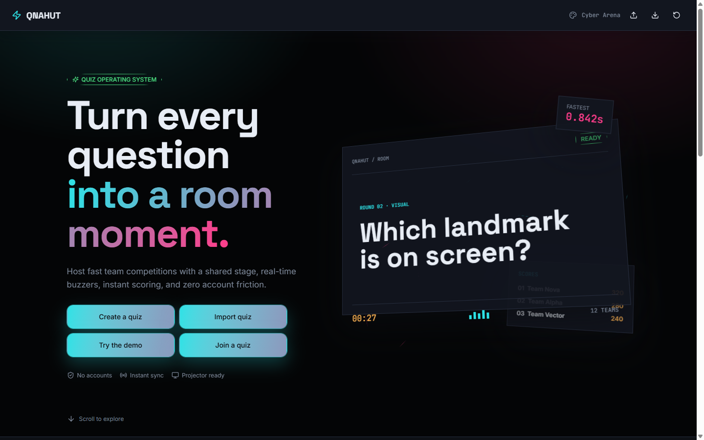

---

## 🎯 One app. Every piece of the show.

| Instead of juggling… | QNAHUT does it |
|---|---|
| **PowerPoint** + a clicker | A question deck with per-question timers, images, video and HTML, answer reveals, and a **big-screen projector view**. Driven from the host dashboard. |
| **A separate scoreboard app** | A live, animated **leaderboard** with one-tap correct / partial / wrong scoring, custom points, undo, and confetti on the shared screen. |
| **A buzzer app** | Real **team buzzers on phones**, timestamped by the server (not the phone) so the first press wins — even on flaky Wi-Fi. |
| **A phone remote / controller** | A password-protected **phone remote** that runs the whole quiz: timer, next question, buzzer reset, reveal answer, and projector views. |
| **Manual bookkeeping & moving files** | Everything — quiz, teams, scores, theme, and uploads — exports to **one `.zip`** and imports back in one step. |

No other software needed. Open the app on the room's laptop, and the host desk,
the projector, every team's phone, and the host's own phone all stay in sync on
your Wi-Fi.

---

## Screenshot gallery

| Surface | Screenshot |
|---|---|
| New-quiz wizard | 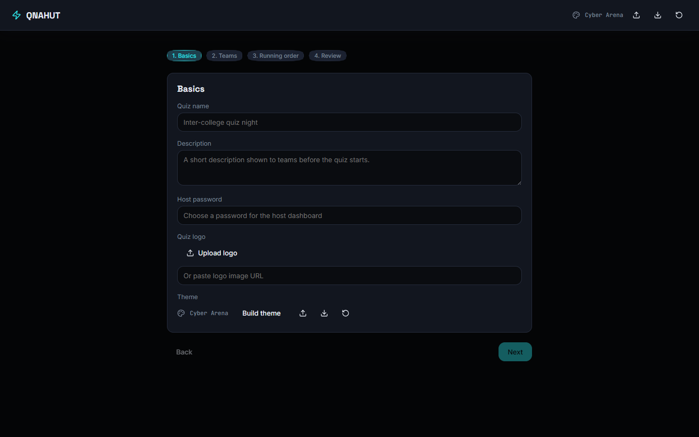 |
| Host dashboard | 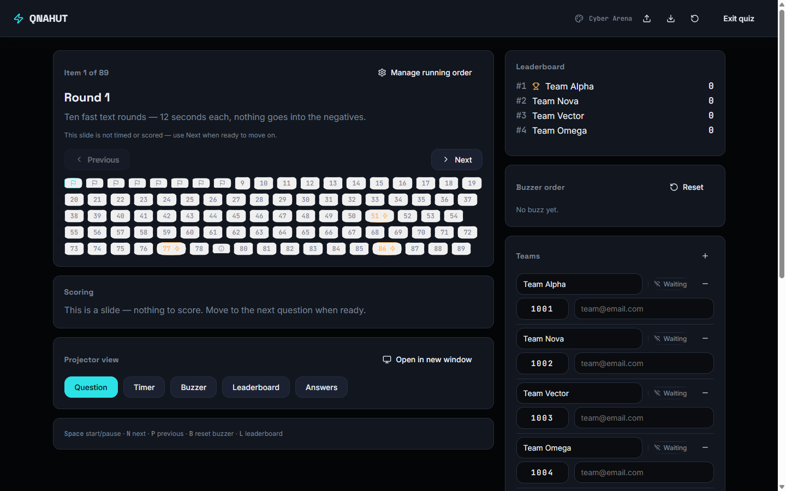 |
| Projector — question | 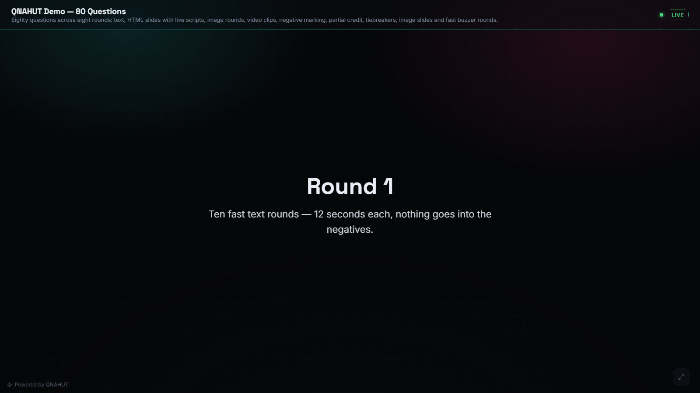 |
| Projector — leaderboard | 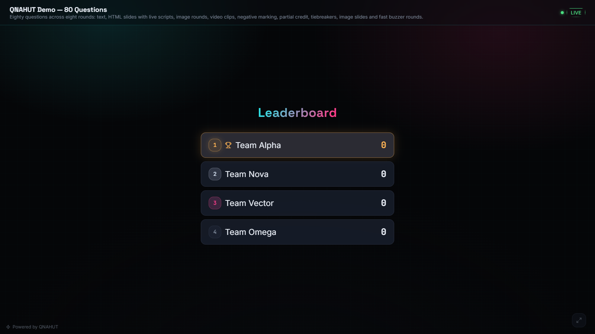 |
| Projector — timer | 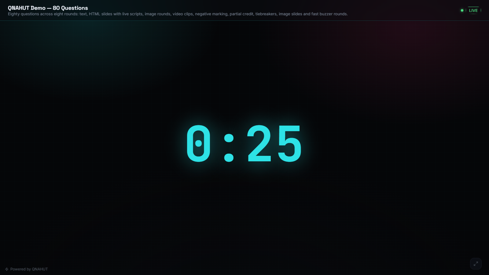 |
| Projector — buzzer (idle) | 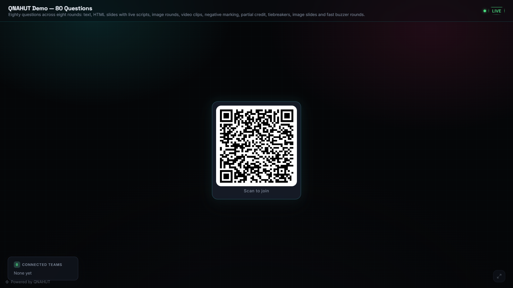 |
| Projector — buzzer (locked) | 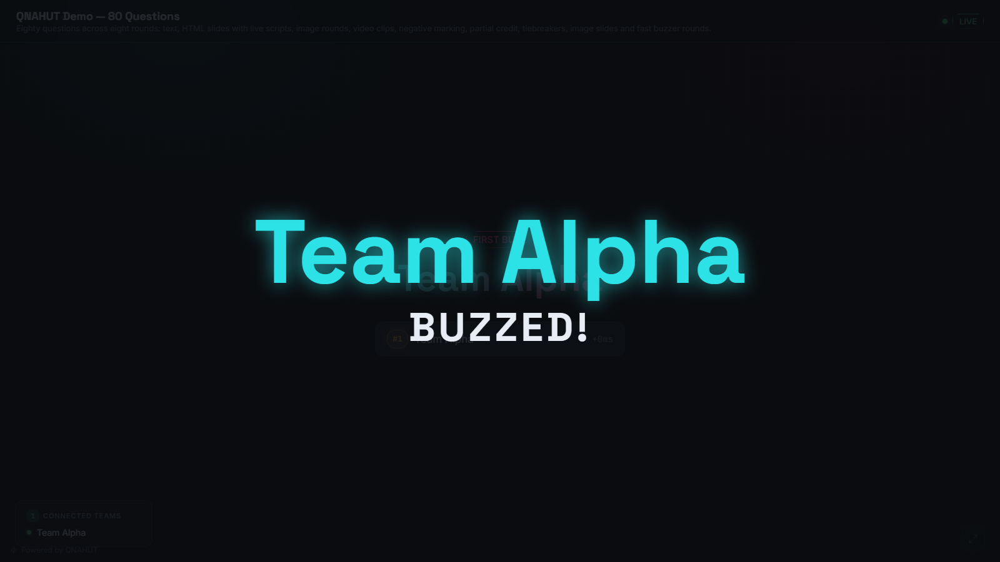 |
| Team phone — buzzer | 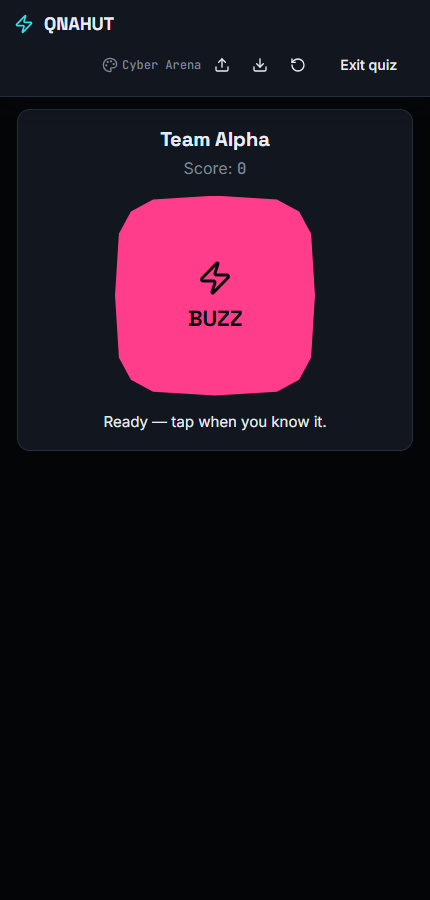 |
| Team phone — buzzed | 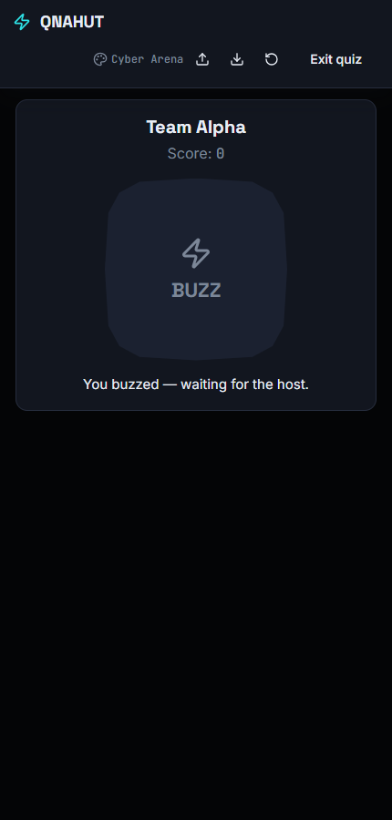 |
| Team phone — join screen | 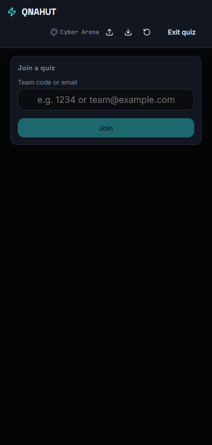 |
| Phone remote control | 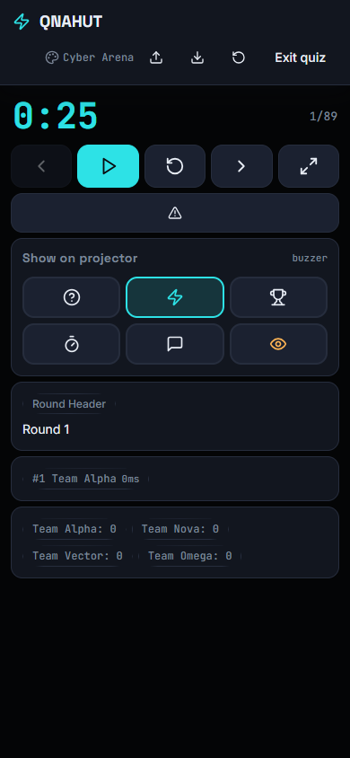 |
| Remote — full-screen question | 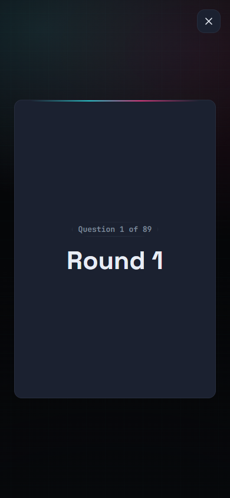 |

---

## ✨ Features

- **One app replaces four** — questions (PowerPoint), scoreboard, buzzer, and
  remote controls all live in one synchronized app instead of four tools that
  don't talk to each other.
- **Four surfaces in sync** — a control dashboard for the host, a chrome-free
  projector screen, per-team phones with a thumb-sized buzzer, and a phone
  remote control for the host. All of them stay in sync in real time.
- **Zero setup** — no env vars, no cloud accounts, no databases. `npm install` + run.
- **Millisecond-fair buzzing** — buzzes are timestamped by the server (or the
  host device), never by the phone's own clock, so the first press wins even
  on flaky Wi-Fi.
- **Per-team buzzer lock** — once a team buzzes, their button locks until the
  host resets the buzzer; optionally let multiple teams buzz per question.
- **Rich question types** — text, image, video, image-only, video-only, and
  custom HTML (scripts allowed) for questions; round headers, info slides, and
  full-screen image slides for non-scored interludes.
- **Fast scoring** — one-tap correct / partial / zero / wrong per team, custom
  score entry, and **undo last action** — with an animated score pop on the
  projector.
- **Broadcast-style projector** — question, timer, buzzer order, and a live
  leaderboard with staggered entry animation and confetti on demand.
- **Full theming** — curated theme presets, custom colors, background image,
  custom logo, custom buzzer sound, and font presets — exported with the quiz.
- **Quiz packages** — export everything (questions, slides, settings, theme,
  and every uploaded image/video) as one `.zip` to back up or move servers.
- **Real-time everywhere** — devices sync over WebSocket + a tiny built-in HTTP
  server; multiple quizzes can run from one server at once (unique quiz IDs).
- **Built-in demo** — a fully populated 80-question / 8-round sample quiz you
  can open instantly to try every feature before building your own.
- **Desktop app** — the same app ships as a Windows desktop build (Electron)
  with the sync server embedded, or runs as a plain Vite dev/preview server.

---

## 🧰 Tech stack

- **React 18 + Redux Toolkit** — all UI lives in one SPA with a shared state store.
- **Vite 5** — dev server and production build. A small dev-only plugin serves
  the sync endpoints.
- **`ws` (WebSocket) + native HTTP** — real-time state sync across the LAN.
- **`qrcode`** — QR codes for team join and phone remote links.
- **`jszip`** — quiz package export/import as `.zip`.
- **Electron + electron-builder** — optional desktop app / installer.
- **BroadcastChannel** — instant sync between windows on the same machine.

No backend database and no sign-ups: quiz state lives in localStorage on the
host device and is pushed to the room over the wire.

---

## 🚀 Getting started

**Requirements:** Node.js 18+

### 1. Install

```bash
cd qnahut
npm install
```

### 2. Run it

```bash
npm run dev
```

This starts the Vite dev server (default `http://localhost:5173` — use
`--port` to change it). Open it on the laptop controlling the quiz. Phones and
the projector join through the share links/QR codes shown in the host's
dashboard — the app auto-detects the machine's LAN address, so everything
works on the same Wi-Fi without configuration.

### 3. Desktop app (optional)

```bash
npm run desktop       # build once, then open in an Electron window
npm run desktop:dev   # dev mode: Vite + Electron with the sync server embedded
npm run desktop:dist  # produce a Windows installer (electron-builder, NSIS)
```

When running as the desktop app, the embedded server listens on
`http://127.0.0.1:3000` by default (`QNAHUT_PORT` to override).

---

## 🖥 The screens

### Landing (`/`) and the setup wizard


Start a new quiz from the landing page. The wizard walks you through:

1. **Basics** — quiz name, description, default team count.
2. **Teams** — rename each team; identity + scores persist by 4-digit code.
3. **Running order** — every question/slide with its timer, round, and scoring.
4. **Review** — a final look, then **Create quiz** lands you on the dashboard.


### Host dashboard (`/quiz`, `?view=projector` for the mirror URL)


| Area | What it does |
|---|---|
| **Main panel** | Current question, media, timer controls (Start / Pause / Reset), next / previous question, **reveal answer**. |
| **Scoring panel** | One-tap scoring per team for the current question, a custom score field, and **Undo last**. |
| **Sidebar** | Per-question status, current index, team list with connection dots. |
| **Share panel** | LAN address + QR for the join page, the projector link, and the phone remote link. |
| **Manage running order** | Add, edit, delete, duplicate, or reorder questions and slides. |
| **Settings** | Modes (leaderboard, buzzer, text-answer, multiple buzzes, projector widgets), theme, logo, timer default, quiz package export/import. |
| **Remote panel** | QR link to open the phone remote. Everything is protected by the quiz's host password. |

**Keyboard shortcuts** (host dashboard):

| Key | Action |
|---|---|
| `Space` | Start / pause the timer |
| `N` | Next question |
| `P` | Previous question |
| `B` | Reset the buzzer |
| `L` | Switch the projector to the leaderboard |

### The projector

Open the projector link (from the Share panel) on the big screen. It's
chrome-free and built for large displays, always mirroring what the host has
selected. It can show:

- **Question** — large type plus media (or full-bleed, for image-only).
- **Timer** — a big synchronized countdown derived from the absolute deadline,
  so every window shows the same number.
- **Buzzer** — "NO BUZZ YET", then a **FIRST BUZZ** announcement with the full
  buzz order and a synthesized (or custom) sound.
- **Answers** — reveal the answer; on timer end the host can flash **TIME'S UP**.
- **Leaderboard** — ranked list with staggered entry animation and optional
  confetti.


### Team phones


Teams open the link (or scan the QR) from the Share panel and type their
4-digit code on `/join` — no account, no sign-up. They land on `/team`:

- A large, thumb-sized **BUZZ** button; the button locks once the team buzzes
  (`YOU BUZZED FIRST` / `BUZZER LOCKED` / `TOO LATE`).
- In text-answer mode, a text field replaces the buzzer button.
- Reconnecting after a dropped connection restores the team's identity as long
  as the same browser tab/session is used.


### Phone remote control


The host can drive the whole quiz from their phone — no need to run back to the
laptop: open `/remote` (link/QR from the dashboard, password-protected) and you
get icon-only controls to

- start / pause / reset the timer,
- next / previous question,
- reset the buzzer and Reveal the answer,
- jump the projector to any view (buzzer, leaderboard, answers),
- and push the current question to full screen for the room.


---

## 📝 Question & slide types

| Type | Scored? | Notes |
|---|---|---|
| Text question | ✅ | Text with optional media. |
| Image question / Video question | ✅ | Uploaded file + optional text. |
| Image-only / Video-only | ✅ | Full-bleed media, no question text. |
| Custom HTML | ✅ | Anything goes — embeds, animations, `<script>` runs on the projector. |
| Round header (slide) | ❌ | Title + body, e.g. "Round 2 — Picture round". |
| Info slide | ❌ | Non-scored title + body. |
| Full-screen image slide | ❌ | A pure image interludes between rounds. |

Every scored question has its own timer, round number + round name, and
scoring (correct / partial / wrong / zero points, plus an **allow partial**
toggle). Images and HTML can also be flagged to display full screen on the projector.

---

## ⏱ Buzzer mode

1. The host enables **buzzer mode** in Settings (or leaves it on from the demo).
2. Each team gets their buzzer on `/team`.
3. Pressing **BUZZ** sends a request that the server/host device timestamps
   itself — never trusting the phone's clock.
4. The first accepted buzz locks everyone else's buzzer immediately and
   broadcasts the order: first buzz → green + sound, rest → locked.
5. **Per-team lock:** the team that buzzed can't buzz again until the host
   resets the buzzer (`B`) or moves on — even with **Allow multiple teams to
   buzz** enabled, so nobody double-buzzes.
6. The host reviews the buzz order and scores, then resets.

Optional toggle: **Require a text answer instead of a buzzer button** — teams
type their answer instead of buzzing.

---

## 🏆 Scoring

- One-tap **+correct**, **+partial** (when enabled), **0**, or **wrong** buttons
  per team — the points come straight from the question's settings.
- **Custom** score field for anything else (bonus, penalty, appeal).
- **Undo last** reverts the most recent scoring event in one click.
- Snippets of the leaderboard float on the projector, with a scale-and-color
  pop whenever a score changes, and **confetti** you can trigger when a team
  takes the lead.

---

## 🎨 Themes & branding

Pick a preset (Cyber Arena, Neon Noir, Deep Ocean, …) or craft your own in the
theme editor: every surface color, fonts, corner radius, a background image,
your quiz logo, and a custom buzzer sound (or use the built-in synthesized
tone). Themes are stored with the quiz and travel with a quiz package export.

---

## 📦 Quiz packages

**Export** — the Settings panel downloads everything — questions, slides,
modes, theme, logo, and every uploaded image/video — as one `.zip`, so you can
back up or relocate a quiz. **Import** loads a package back in one step,
including its theme.

There's also a script that pre-builds the bundled demo quiz as a package:

```bash
npm run demo:package
```

---

## 🎲 Demo quiz

The app ships fully seeded — open it instantly to try every feature:

- **Quiz ID:** `demo`
- **Host:** open `/quiz?demo=1` (auto-fills the host token)
- **Team codes:** `1001` Team Alpha · `1002` Team Nova · `1003` Team Vector · `1004` Team Omega
- **Projector/team/remote:** use the share links from the dashboard
- **Content:** 80 questions across 8 rounds (text, image, video-only, HTML, …)
  with mixed positive/negative/partial scoring and slides.

---

## 🔌 Sync architecture

```
Host machine
  └─ the app (Vite dev server, or Electron desktop)
       └─ tiny built-in server (HTTP + WebSocket)
              ├─ /__qnahut-host        → advertises the LAN address
              ├─ /__qnahut-active      → list of live quizzes
              ├─ /__qnahut-quiz/:id    → snapshot hydration for late joiners
              └─ /__qnahut-ws          → real-time state channel
                     │
                     ├─ Host dashboard (the source of truth)
                     ├─ Projector mirror(s)   (open the ?view=projector URL)
                     ├─ Team phones           (/join → /team)
                     └─ Phone remote          (/remote · password protected)
```

- The host keeps the authoritative quiz state in memory + localStorage and
  pushes snapshots out over a WebSocket channel.
- Windows on the same machine also sync instantly via **BroadcastChannel**,
  with a WebSocket tap merged in for LAN devices.
- Receivers derive the display from absolute timestamps (e.g. the timer counts
  down from a deadline, never from a stored "remaining" value) so laggy or
  stale connections can't show a different clock.
- Buzzer events are stamped by the server to stay fair, then merged from the
  WebSocket tap. The projector deep-links with a token so random visitors can't
  connect.
- A quiz stays unique via its **quiz ID** — you can host several different
  quizzes from one server and each keeps its own teams, scores, and projector.

---

## 🗂 Project structure

```
qnahut/
├── package.json
├── vite.config.js              # dev server + sync plugin (HTTP + WebSocket)
├── electron/
│   ├── main.cjs                # desktop shell + embedded sync server (port 3000)
│   └── preload.cjs             # frameless window controls bridge
├── scripts/
│   └── make-demo-package.mjs   # demo quiz → .zip package
├── docs/screenshots/           # README screenshots
├── demo/                       # build output of the demo quiz package
└── src/
    ├── main.jsx                # entry → App
    ├── App.jsx                 # routes / landing / host / projector / team / remote
    ├── contexts/               # QuizContext, NavigationContext, ThemeContext
    ├── store/                  # Redux store
    ├── utils/                  # sync (ws + BroadcastChannel), quizPackage, quizFactory, theme
    ├── data/                   # demoQuiz.js, defaultTheme.js
    ├── hooks/                  # useHostShortcuts, etc.
    └── components/
        ├── common/             # Button, Modal, Panel, MediaUpload, QuestionForm…
        ├── landing/            # Landing page
        ├── wizard/             # Basics → Teams → Running order → Review
        ├── host/               # HostDashboard + MainPanel/ScoringPanel/Sidebar/
        │                       # SharePanel/QuestionManager/SettingsPanel/RemotePanel
        ├── projector/          # Projector + per-view widgets
        ├── team/               # /join and /team screens
        └── remote/             # RemoteControl
```

---

## 🛠 npm scripts

| Script | What it does |
|---|---|
| `npm run dev` | Vite dev server (default port 5173, add `--port <n>` to change) |
| `npm run build` | Production build to `dist/` |
| `npm run preview` | Preview the production build |
| `npm run desktop` | `build` then launch the Electron app |
| `npm run desktop:dev` | Vite + Electron together (hot, with embedded server) |
| `npm run desktop:dist` | Build a Windows installer (`release/`) |
| `npm run demo:package` | Write the demo quiz as a `.zip` package |
| `npm run lint` | ESLint (warnings fail) |
| `npm run format` | Prettier write |
| `npm run format:check` | Prettier check |

---

## 🤝 Contributing

Issues and pull requests are welcome. If you spot a bug or have an idea for a
feature, open an issue on the [GitHub repo](https://github.com/vighneshn2008/qnahut).

## 📄 License

MIT.